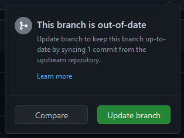

# PlaceholderAPI Wiki

Welcome on the Wiki branch!

This branch is home of the [PlaceholderAPI Wiki's][wiki] source.  
It allows us to properly manage the wiki and it allows you to contribute changes to it.

## Contributing to the Wiki

Contributions to the wiki are always welcome, granted they follow specific rules and guidelines to ensure a consistent styling across all pages.  
Please read this readme file carefully, as it contains important information on how you contribute to the wiki and what to look out for.

### Prerequisites

This readme file will cover the basics of using Git, GitHub and MkDocs, but it is highly recommended to learn about these tools yourself before contributing, to avoid possible issues.  
If you have questions about any of those, do not hesitate to ask. We will try to assist you as good as we can.

Before you now start working on the wiki should make sure that the following has been done already:

- You installed and configured Git.
- You installed and configured Python. At least 3.10 is required for MkDocs to work.
- You installed MkDocs and all required dependencies. You can just install `mkdocs-material` through pip and all necessary dependencies will be included.

Should the above be completed can we start with the process of contributing to this wiki.

### 1. Fork the Repository

> **Already have a fork?** Skip to the [next step!](#2-switch-target-branch)

You need to make a fork of the PlaceholderAPI Repository in order to make your changes to it.  
To create a fork, click the button on the top right that says "Fork". This will open a new page where you can set specific options such as the name of the fork (Defaults to the name of this repository), the account/organization this repo should be forked to and whether only the master branch should be included.

It is crucial to set ``Copy the `master` branch only`` to **not** be checked, or else the wiki branch won't be included in your fork.


Once you confirm the fork will a copy of the repository be created under the user/organization you chose. This process should only take a few seconds and you will be automatically redirected to your fork after it completed.  
You can now move on to the next step.

### 2. Switch target branch

By default will you be on the default branch of the repository (`master`). To now get to the wiki branch, click the button that says `master` (Located to the left of the text reading `n Branches`).  
A dropdown should open with all the branches you included during the forking. Select the `wiki` branch in the list to switch to it.


### 3. Fetch Changes from Upstream

> This step is only required for old forks that haven't been updated in a while.

While you're on the `wiki` branch, click the `Sync Fork` text located right below the green `Code` button.  
Doing so will show you a box with one of two possible messages:

- ``This branch is not behind the upstream `PlaceholderAPI/PlaceholderAPI:wiki`.``  
  This text indicates that your fork is up-to-date with the original repository's wiki branch and does not need any updating.
  
- `This branch is out-of-date`
  This text indicates that your fork is outdated and should be updated with the latest changes from the original repository. There should be a button labeled `Update branch` that you can press to update your fork's `wiki` branch.  
  

### 4. Clone to a local Repository

It is recommended to clone your fork to your PC to utilize tools such as MkDocs' live-preview to see the changes made.  
To clone your fork to your PC, first choose where it should be cloned towards. Cloning the repository will create a new folder with the repository's content in it, so if you choose to clone into a folder named `GitHub` will this result in `GitHub/PlaceholderAPI` being created.

Copy the below command and execute it in your git-bash console (Replace `<user>` with the user/organization name of your fork):  
```sh
$ git clone -b wiki https://github.com/<user>/PlaceholderAPI
```
This will clone the repository onto your PC with the `wiki` branch being selected by default.

You should now navigate into your cloned repository in the git-bash console using `cd PlaceholderAPI`.

### 5. Create a new branch (Recommended)

This step is optional, but recommended to keep the main wiki branch clean from any changes, which avoids possible merge conflicts in the future.

To create a new branch, execute the command below (Replace `<branch>` with the branch name you want to use):  
```sh
$ git checkout -b <branch>
```

> [!TIP]
> In case you already created a branch on GitHub before cloning the repository can you use `git switch <branch>` to switch to this branch.

### 6. Make your changes

It is now time to make your changes. It is recommended to use MkDocs and its live-preview feature to see your changes applied in real time whenever you save a file.

To use the live-preview, run `mkdocs serve` in the same folder where the `mkdocs.yml` file is located. This should start a server on `http://127.0.0.1:8000` that you can open in your browser.  
Should the command not work, check that you actually installed MkDocs and any required dependencies. The easiest way is to just execute `pip install mkdocs-material` to download the Material for MkDocs theme alongside additional dependencies, including MkDocs.

To cancel the live preview, simply press <kbd>Ctrl</kbd>+<kbd>C</kbd> in the git-bash terminal to shut the live preview server down.

#### Markdown Formatting Rules

> [!IMPORTANT]
> Please also see the [Wiki Structure](#wiki-structure) section for more details on the formatting!

MkDocs utilizes Python-Markdown, a Python library used for parsing Markdown into HTML. This library follows very specific rules in regards to Makrkdown formattings that you need to keep in mind while editing files.

Here are some noteworthy points:

- Lists require an empty line before themself to be rendered as such. This means that a list cannot start directly after some text, but needs a gap before itself.
- New lines in lists (No matter if ordered or unordered) need to have an indent of 4 spaces.
  - This indent also applies to nested list entries.
  - In certain situations will you also need to keep an empty line between the list entry and the new line.
- Links to other files should be relative and also include the file name itself. They will be parsed into proper `a` tags pointing to the page when rendered.

In addition are extensions used to further enhance the default markdown formatting with additional features. Such features include:

- Admonition blocks (Also known as callouts. [[Documentation][admo-docs]])
- Details (`<details>` HTML tag. [[Documentation][details-docs]])
- Tabs (Way of displaying different content you can toggle between. [[Documentation][tabs-docs]])
- Automatic linking of issues, PRs, discussions using `!<id>`, `#<id>` and `?<id>` respectively (Uses [MagicLink extension][ml-docs])

### 7. Commit and push your changes

Once you're happy with your changes is it time to commit them back to your fork on GitHub to then PR to the upstream repository.

To commit your changes, you may first need to add the files to commit. To do this, run `git add <file-path>` where `<file-path>` is the path to the modified file relative to the repository's root.  
As an example, changing `placeholder-list.md` would require you to execute `git add docs/users/placeholder-list.md`.

If you're sure that only files that should be commited got changed can you use `git add .` to add all changed files.

Once this step is done can you execute `git commit`. Doing so will open a text editor where you can write the commit message in. Try to keep it short and simple. You can also append the `-m` argument followed by text inside double quotes to the command to directly set the commit message without having to use a text editor.

Once your changes got committed will you need to execute `git push`. In case you created a new branch in your local repository will you need to add `--set-upstream origin <branch>` with `<branch>` being the name of the branch you want to use on your fork on GitHub.

Your changes should now be on your GitHub Fork.

### 8. Create a Pull request

Your final step now is to make a Pull request to the original repository. GitHub should already give you a prompt regarding recent changes on your branch.


Clicking the "Compare & pull request" button will open a diff view page showing a comparison between your changes and the branch of the upstream. You can double check that it targets the upstream by checking that there is a `base repository` option pointing to `PlaceholderAPI/PlaceholderAPI`. Should there only be a `base` option does it mean that you target branches on your own repository. To fix this, click the text that says "compare across forks" to toggle. You can then select `PlaceholderAPI/PlaceholderAPI` as the `base repository` and `head repository` to your fork.

By default does GitHub select the `master` branch as the default. Change it to `wiki` while also changing the branch of your fork to whatever you made your changes on (Should be selected by default).


Should there be changes that can be merged will the "Create pull request" button light up, allowing you to make a pull request.  
Press the button, fill out the title and body of the pull request and create it.

Congratulations! You made a Pull request for the wiki!

----

## Wiki Structure

The wiki has specific rules in regards to its own structure. This is to keep a level of consistency across all pages when viewed at in their raw (unparsed) form.

### General Rules

The following rules apply to all pages:

1. Unordered lists always use `-` and not `*` to avoid confusion with `*italic text*`
2. Links to other pages always need to be relative, meaning they should not start with `/`.
3. An empty line between a header (Any level) and text should be set.

### Placeholder List Rules

The following rules apply specifically to entries in the [Placeholder List][placeholder-list] page:

1. Entries need to be in alphabetical order.
    - Should an entry with the name already exist will you need to add yours after it.
2. An entry follows this specific format:
   ````markdown
   - ### [<name>](<link>)
       > <command>
       
       <text>

       ```
       <placeholders>
       ```
   ````
   - `<name>` is the name of the Placeholder expansion you add.
   - `<link>` is a link to the plugin this expansion is made for. If the expansion is not for a plugin should no link be added (Only `- ### <name>` be used).
     - Links to spigot pages need to be sanitized, meaning a link such as `https://www.spigotmc.org/resources/placeholderapi.6245/` becomes `https://www.spigotmc.org/resources/6245/`
   - `<command>` is the [`/papi ecloud download`][download-command] used to get the expansion. Should the expansion not be on the eCloud will you need to put `NO DOWNLOAD COMMAND` here.
   - `<text>` is an optional text that can be used to point to extra documentation. Please keep it short and simple.
   - `<placeholders>` would be all available placeholders. Each entry should be on a new line.
     - Please avoid explicit examples and instead use `<>` and `[]` to indicate required or optional values (i.e. instead of `%expansion_SomePlayer%` it would be `%expansion_<player>%`)
3. Make sure to also add an entry to the list at the top of the page, linking to your entry.
4. Should your entry have entries before and/or after it will you need to add horizontal lines (`----`) to separate yours from these entries. Keep an empty line between the horizontal line and any entry.

> A [online tool][papi-list-gen] exists for your convenience to create the markdown for a new entry.

### Plugins using PlaceholderAPI Rules

The following rules apply specifically to entries in the [Plugins using PlaceholderAPI][plugins-using-placeholderapi] page:

1. Entries need to be in alphabetical order.
    - Should an entry with the name already exist will you need to add yours after it.
2. An entry follows this specific format:
   ````markdown
   - [<name>](<link>)
       - [?] Supports placeholders.
       - [?] Provides own placeholders. [<link>]
   ````
   - `<name>` is the name of the Plugin you add.
   - `<link>` is a link to the Plugin page. Should no plugin page exist can a GitHub repo or no link (Just `- <name>`) be used instead.
     - Links to spigot pages need to be sanitized, meaning a link such as `https://www.spigotmc.org/resources/placeholderapi.6245/` becomes `https://www.spigotmc.org/resources/6245/`
   - `[?]` needs to be replaced with either `[x]` or `[ ]` depending on if the statement is true or not.
     - `Supports placeholders.` means that the Plugin allows the usage of any placeholder through PlaceholderAPI in its messages, settings, etc.
     - `Provides own placeholders.` means that a Placeholder expansion is available that provides placeholders through PlaceholderAPI for this plugin.
   - `<link>` should be replaced with one of two possible options, depending on whether there is a placeholder expansion listed in the [Placeholder List][placeholder-list] page.
     - In case there is one should `[**Link**](placeholder-list.md#<expansion>)`, where `<expansion>` being the name used in the list, be used.
     - In case there is no entry should `Link` be used.

> A [online tool][plugin-list-gen] exists for your convenience to create the markdown for a new entry.

[wiki]: https://wiki.placeholderapi.com

[admo-docs]: https://facelessuser.github.io/pymdown-extensions/extensions/blocks/plugins/admonition/
[details-docs]: https://facelessuser.github.io/pymdown-extensions/extensions/blocks/plugins/details/
[tabs-docs]: https://facelessuser.github.io/pymdown-extensions/extensions/blocks/plugins/tab/
[ml-docs]: https://facelessuser.github.io/pymdown-extensions/extensions/magiclink/

[placeholder-list]: https://wiki.placeholderapi.com/users/placeholder-list/
[download-command]: https://wiki.placeholderapi.com/users/commands/#papi-ecloud-download
[papi-list-gen]: https://papi.andre601.ch/generators/placeholder-list/

[plugins-using-placeholderapi]: https://wiki.placeholderapi.com/users/plugins-using-placeholderapi/
[plugin-list-gen]: https://papi.andre601.ch/generators/plugin-list/
